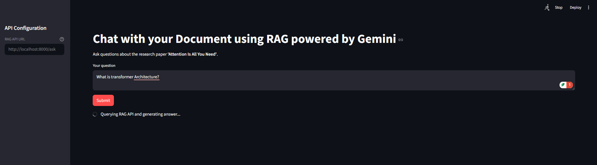
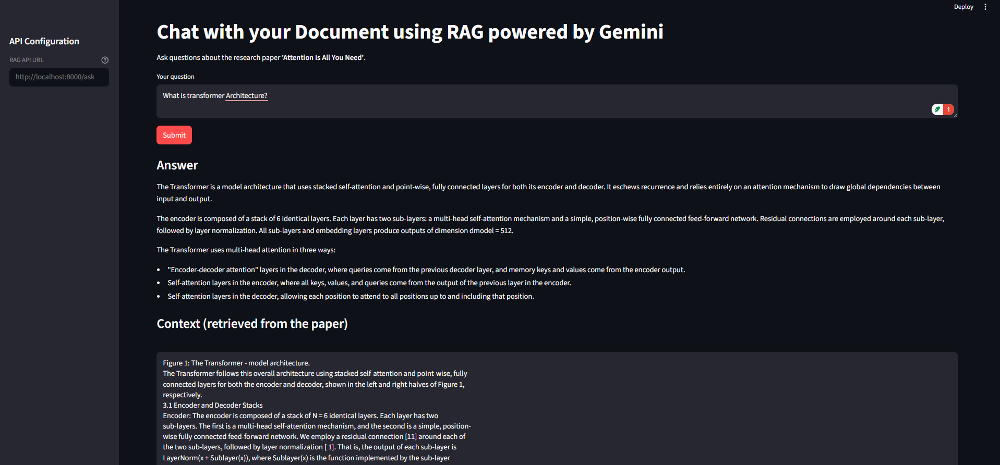

# Tharindu-RAG-assesment

This project is a Retrieval-Augmented Generation (RAG) service built for the Document with streamlit UI and dockerization

It:

- Ingests the paper **“Attention Is All You Need”** (PDF)
- Splits it into chunks, embeds them using a Sentence-Transformers model
- Indexes embeddings in a **FAISS** vector store
- Uses a **Gemini** LLM to answer questions using retrieved context
- Exposes a **FastAPI** endpoint (`POST /ask`)
- Provides an optional **Streamlit** UI that consumes the API
- Is fully containerised with a **multi-stage Dockerfile**

---

## 1. Project Structure

* **Tharindu-RAG-assesment/**
    * `main.py` — FastAPI app (RAG API)
    * `rag_engine.py` — RagEngine: ingestion, vector store, LLM, RAG pipeline
    * `models.py` — Pydantic models for request/response
    * `app_streamlit.py` — Streamlit UI
    * `requirements.txt` — Python dependencies
    * `Dockerfile` — Dockerfile
    * **data/**
        * `attention.pdf` — Source paper 
    * `README.md`

2\. Prerequisites
-----------------

*   Python **3.10** or higher
    
*   pip
    
*   Docker
    
*   A Google Generative AI API key (Gemini)
    

3\. Environment Setup
---------------------

### 3.1. Clone the repository

  git clone https://github.com/TharinduGun/Tharindu-RAG-assesment.git

### 3.2. Create Virtual environment and Install dependencies

 pip install -r requirements.txt   `

### 3.3. Configure environment variables

Configure the .env file with GEMINI API key and model
    

4\. Running the FastAPI Server Locally
--------------------------------------

With your environment activated and .env configured run in root directory:

 uvicorn main:app --reload   

The server will:

*   Ingest and index the research paper and store in FAISS
    
*   Initialize the Gemini LLM client
    
*   Check at :**http://127.0.0.1:8000**
    

### 4.1. Test the API

Open Swagger UI:
 http://127.0.0.1:8000/docs   `

Use POST /ask with:
 {    "question": "What is the Transformer architecture?"  }   `

Expected response:
`   {    "question": "...",    "answer": "...",    "context": "..."  }   `

5\. Building & Running the Docker Container
-------------------------------------------

The project includes a **multi-stage, well-commented Dockerfile**.

### 5.1. Build the image
`   docker build -t rag-transformer-api .   `

### 5.2. Run the container

Pass required environment variables:

docker run --rm -p 8000:8000 -e GEMINI_API_KEY="YOUR_API_KEY" rag-transformer-api

Access the API at:
`   http://localhost:8000/docs  `

6\. Running the Streamlit App 
----------------------------------------

The Streamlit UI is a separate frontend that **calls the FastAPI microservice**.

### 6.1. Ensure the FastAPI server is running

Either:

*   Run it locally (uvicorn main:app --reload) **OR**
    
*   Run inside Docker (docker run ...)
    

### 6.2. Launch the UI

`   streamlit run app_streamlit.py   `

It will open:

`   http://localhost:8501   `

### 6.3. How to use the UI

1.  Enter a question (e.g., _“What does self-attention do?”_)
    
2.  Click **Submit**
    
3.  The UI will:
    
    *   Send a request to /ask
        
    *   Display the generated answer
        
    *   Show retrieved context chunks from the PDF
        

